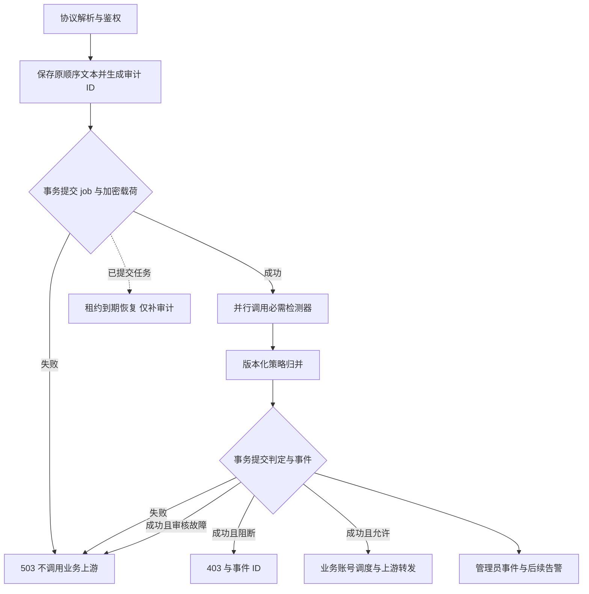

# 提示词风控迭代设计

日期：2026-09-08。状态：设计提案，业务默认规则见 [PRD](prd.md)，实施顺序见 [实施清单](implement.md)。

## 1. 设计结论

复用 `securityaudit`、现有 OpenAI Moderation 与 Qwen3Guard-Gen、PostgreSQL、Vue 管理页。新增严格执行 profile，把“审核前保存输入、审核后提交判定、最后允许转发”连成闭环；补充原文访问审计、过期清理、告警和复核。无需新建网关或引入消息中间件。

| 阶段 | 可交付结果 | 退出条件 |
| --- | --- | --- |
| P0 基线 | 明确规则映射、独立样本集、部署候选和实际接口覆盖表 | 来源明确，误报反例齐全，旧语义与目标差异可评审 |
| P1 核心闭环 | 同步拒绝、加密持久输入、可恢复任务、原文受控查看、清理 | 故障注入与协议门禁通过，无已放行但未提交审核结果的路径 |
| P2 运营闭环 | 重复尝试告警、复核状态、用户风险统计、运行告警 | 多实例不重复计数，误判可纠正，告警失败可重试 |
| P3 实际验收 | 真实模型盲测、容量报告、灰度和回滚证据 | 达到明确上线门槛后才扩大分组覆盖 |

各阶段都包含本阶段测试，P3 不是延后补测。P1 可独立部署为关闭状态；整体用户目标在 P2、P3 通过后才算交付。

## 2. 运行边界与配置

在现有 `off / async / blocking` 上增加 `enforcement_profile=legacy|strict_v1`，升级默认 `legacy`。只有所选分组处于 blocking 且明确选择 strict_v1 时才执行新链路。原模式回归测试保持不变。

strict_v1 的激活条件：风控总开关与审计开关打开、必要节点配置齐全、全局证据保护 encrypted_v1 已就绪、数据库版本支持、规则版本有效、指定入口能完整提取其声明支持的文本。`blocking_latest_turn_only=true` 与严格完整文本审核互斥，保存配置时拒绝此组合。

本版 strict_v1 的必需检测器为 OpenAI Moderation 与 Qwen3Guard-Gen。配置、配额、认证或依赖错误不得表现为“未命中”。可配置同一类引擎的备用节点，备用必须满足相同政策和输出契约，不能自动换成宽松模型。

配置仍复用版本 CAS、不可变运行快照和跨实例刷新。每个已接纳请求固定 policy/config/extractor 版本及审核模型身份，后续热更新不改变它的归并规则。配置损坏时保留已知严格意图并拒绝，不能通过解析失败回到 legacy。关闭 strict 是显式、可审计的运维动作。

本版不增加线上 shadow 执行模式。先在隔离环境以同一 strict 策略重放合成/已授权样本，再进行指定分组的阻断试点。现有 legacy async 可用于流量基线观察，其判定不能替代 strict 策略评测。

## 3. 同步请求流程

“业务上游”不包括必要的审核模型调用。审核本身可能耗时和产生成本；拒绝不应触发用户业务用量扣费。

1. Handler 在原有安全门禁位置建立服务端 `audit_attempt_id`，一次 HTTP 请求一个，WS 每次 response.create 一个；不信任客户端 request_id 的唯一性。
2. 鉴权提供 user ID、当时用户名/邮箱/API Key 名称与分组。提取输入后，短事务写 job + 加密 payload；不得持有事务跨模型网络调用。
3. 两个检测器只提供分类结果。严格 profile 不能直接使用会更新 Hash/封号/发邮件的旧 `Check` 作为纯分类器。
4. 从旧 Moderation 中提取可复用的无副作用评估方法，复用请求客户端、阈值与必要缓存。旧 Check 包装此方法并维持原模式行为；严格调用返回显式 `ok/error/skipped`，必需检测器 skipped 视为审核不可用。
5. 策略层生成最终动作，在第二个短事务更新 job、必要事件与保留期限；仅 `outcome=allowed` 在该事务删除密文载荷并保留短期任务元数据。`suspicious` 虽允许继续，仍在同一事务保存事件和 30 天原文；不能按 AllowNextStage 删除载荷。
6. 只有最终审核事务提交成功且允许继续、客户端仍连接时，才进入原业务流程。原 body 不改写，完整文本证据与扫描视图均不替换待转发载荷。

严格 profile 不新增自动封号、用户邮件和永久 Hash 阻断。旧模式仍按原规则执行；严格分组必须在配置页明确显示此差异，不能从老日志里自动补算处罚。严格评估也不能让旧 `observe` 模式变成隐式异步放行。

旧审核的关键词/Hash/缓存结果不能无条件成为严格决策。严格缓存至少包含完整扫描视图 hash、规则与阈值版本、模型身份、扫描范围和适用分组；未知来源的旧 Hash 只能作为历史信号。两引擎共享同一完整证据来源，不能再次经过旧提取器的截断路径。

## 4. 模型结果与平台规则

新增只负责信号的结果类型，至少包括 `engine/status/model_id/model_revision_or_alias/raw_level/categories/scores/score_kind/latency/error_code/coverage`。保留原字段兼容读取，但 Qwen 的离散等级必须标记 `ordinal`，不得作为概率或与 OpenAI score 求平均。

策略目录记录 `rule_id/policy_version/basis/action/evidence_requirement/threshold_version`。basis 区分 `provider_policy` 和 `service_security`。OpenAI 政策条目需在 P0 登记原文版本；不能以 Qwen 的政治敏感、不道德等类别直接声称 OpenAI 违规。

| 归并条件 | 最终结果 |
| --- | --- |
| 任一成功结果命中已启用且已校准的 block 规则 | `policy_blocked` 或 `attack_blocked`；其他引擎故障仍单独记录，不抹掉已有可靠阻断依据 |
| 没有 block，但必需引擎缺失/失败/非法响应/不能完成声明范围 | `system_error`，503 |
| 无故障，仅 Controversial、未配置为阻断的类别或疑似攻击 | `suspicious`，放行并保存待复核事件 |
| 全部必需引擎成功且无禁止或疑似规则命中 | `allowed` |

规则示例：校准后的 OpenAI 类别与阈值、Qwen Unsafe 且属于明确禁止的行为，可独立触发内容规则；Qwen Unsafe + Jailbreak 可作为站内攻击规则候选，但必须通过引用研究、合法 system 指令和修改需求等反例测试后才能开启阻断。Controversial 的 jailbreak/PII/自伤不再仅因类别被自动升为阻断。

健康求助、教育、引用、授权逆向等上下文影响解释。分类器不提供充分依据或该规则误拦未达标时，保留为 suspicious，不能通过调高本地伪分数将其包装成高置信度。遇到模型新增未知输出结构，应显示格式/版本错误；不能默默当作安全。

## 5. 文本证据与扫描覆盖

新增 versioned payload JSON，保存 `schema_version`、`extractor_version`、`protocol` 和原顺序的 `segments[index, role, json_path, content_type, text]`。text 保存用户提供的原始文本，不做 NUL 清除、Unicode 改写或新旧消息重排。认证身份放在 job 的可信快照字段，输入中的同名字段不参与身份绑定。

原文限于模型可见内容，不复制 Authorization、Cookie、审核节点 token 等传输凭据。输入文本中本身包含的密钥仍作为证据加密保存，普通预览脱敏。不会把整个 HTTP body 无差别塞进日志。

| 协议 | 首期必须提取的字段族 |
| --- | --- |
| Chat | messages 各角色的文本 content、tool_calls/function_call 的名称及 arguments、tool 消息返回、tools/functions 的名称/说明/参数 schema 文本、response_format schema 中的文本说明 |
| Responses HTTP/WS | instructions、input 文本/消息、function_call.arguments、function_call_output.output、对应工具定义、text.format schema；WS 根节点与 response 包裹两种结构 |
| Claude | system、messages 文本、tool_use 的名称/input 中模型可见值、tool_result.content 的文本与嵌套文本块、tools 的说明/input_schema 文本 |
| Gemini | systemInstruction、contents.parts.text、functionCall args/functionResponse 的文本值、tools.functionDeclarations 的说明与 schema 文本 |
| 图片/媒体 | 当前入口实际支持的 prompt/negative_prompt/编辑指令等文本字段，名称由路由契约登记 |

由协议结构化解析器遍历已登记字段及嵌套块，维护版本化支持表；参数结构使用 JSON 解析，不用正则模拟解析或无限解码 Base64。明确不供模型读取的 metadata/路由字段可排除，并登记排除原因。已知转发给模型但无法解析的文本内容类型为 `unsupported_content`，strict 返回 400 且不转发。测试必须包含“正常 user 文本 + 工具返回/参数里的危险文本”，不能因存在一段正常文本就标完整。P0 同时枚举路由和字段，后续协议扩展更新此表与测试。

另保存 `capture_complete`、`coverage_scope=current_request_text`、`omitted_kinds`、`referenced_history_present`、`scan_manifest`。hash 对规范化结构计算，原文与扫描文本有各自 hash；命中位置用 segment index 和原始字符区间定位。模型不给位置时写 unavailable，不能把整段伪装成精确命中片段。

扫描视图是独立派生物，必须采用实际 Qwen3Guard-Gen 支持的模板；模型不支持任意多轮角色时，不假装发送多角色 JSON 就获得多轮理解。P0 验证适配模板，记录其版本；输入中的 role/边界标记可伪造，分类器不能因此获得新的信任规则。

长文本采用模型适配器的实际上下文预算、保留来源的分片和有限重叠窗口。使用模型对应的 tokenizer 或推理服务能力验证预算，不把字符数等同 token。规则应校验跨片边界反例；全片扫描仅证明覆盖输入，不证明跨片语义完整。资源或上下文预算无法覆盖声明范围时，返回明确的不能完整检查状态，strict 不静默放行。

载荷上限由已公布的网关文本限制和隔离容量测试确定，配置前置校验；P0 输出具体字节/token/最大分片数值。不得沿用 65536 字符截断作为成功条件。超过公开上限为 413/协议对应的资源错误，不计用户违规。此技术参数在启用前冻结，不影响“超限不静默放行”的业务规则。

图片/音频/文件 URL 和 previous_response_id 指向的内容不主动抓取。请求包含可用文本时仅检查文本，记录附件/历史未覆盖；纯媒体且无可检查文本的严格入口返回 400 `prompt_guard_input_unsupported`。客户端实际提供的全部文本才是 capture_complete 的判定范围。

## 6. 持久化与恢复

### 6.1 数据变化

沿用 `prompt_audit_jobs/events`，新增 `prompt_audit_payloads`；不借用账号调度 outbox 表，不以 Redis TTL 作为严格模式唯一原文来源。

| 对象 | 新增/调整 |
| --- | --- |
| jobs | 唯一 audit_attempt_id、不可变 user_id_at_request/api_key_id_at_request、lease owner、strict execution mode、policy/config snapshot、request_outcome、response_intent、recovery_result |
| payloads | id 主键、job_id 外键、可空 event_id 外键、kind、ciphertext、key_id、format_version、content_hash、byte_length、expires_at；删除对应父记录时级联删除 |
| events | 每个严格 job 唯一请求事件、event_type、不可变原请求结果、双引擎结果、单独恢复结果、rule IDs、coverage、payload_status、复核投影；旧事件保持可读 |
| audit_logs | 使用现有仓储增加同步记录方法，用于原文访问/复核；只存 ID、操作者、动作和结果 |
| alerts（P2） | 有状态站内告警与去重窗口；外部通知任务附属于独立审计模块 |

旧 job 不强制填充新唯一 ID；使用非空/严格模式的部分唯一索引。现有 events 可能一 job 多事件，不能直接对历史数据强加全局唯一约束。迁移前审计真实分布，新 profile 通过独立约束与条件更新保证唯一。

payload 的 `kind=strict_capture` 按 job_id 部分唯一，event_id 为空，支持审核前写入；`kind=legacy_event` 必须有 event_id 并按 event_id 唯一，适配历史同一 job 多事件且文本不同的情况。reveal 明确按 origin 选择载荷，禁止仅按 job_id 取第一条。新 system_error/recovered 事件需扩展 API/前端枚举，不能硬塞成旧 pass/critical 并污染统计；前端支持这些类型是启用新 profile 的前提。

### 6.2 状态机

严格 job 增加独立状态与 execution_mode，更新 migration 的 CHECK 约束。原异步 worker 的 claim/reclaim SQL 必须显式排除 strict job；旧 worker 即使混跑也不能认领严格新状态。

`strict_inflight -> strict_done | strict_recovery_pending -> strict_recovering -> strict_done | strict_failed`

首写直接建立有 owner、claim_version 和 lease 的 inflight job。活跃请求续约；恢复 worker 只领取过期/待恢复任务，领取时原子增加 claim_version。收尾 UPDATE 必须匹配版本，旧进程迟到结果不可覆盖新 owner。复用现有 SKIP LOCKED/租约思路，不复用未经隔离的旧 claim SQL。

`request_outcome/response_intent` 与恢复任务状态分离。原请求正常完成或明确阻断则 strict_done；原请求遇到可恢复的 Guard 故障且结果事务成功时，写唯一 system_error 请求事件、固定 response_intent=503，job 仍为 strict_recovery_pending。恢复成功只填独立 recovery_result，原 503 和错误依据不可修改，随后 job 才变 strict_done；恢复失败达次数/24 小时上限则 strict_failed。

如果原结果事务从未提交，恢复时原请求结果是 unknown、response_intent 为空，不能根据重审推断当时返回 403 或 503；只建立唯一 recovered 事件并附重审结果。初次扫描与恢复有独立标识，恢复最多执行 3 次模型重审，具体退避在 P0 容量参数中冻结。恢复结果无论是否命中，都不进入实时阻断计数。

恢复在原 24 小时窗口内发现风险/疑似时，保留期可调整为 created_at + 30 天；不产生风险则清除原文。任何恢复都不能延长到比首次接纳 30 天更晚，也不能恢复已过期或被删除的载荷。

恢复重新调用 Guard 时优先使用原 policy 和模型版本；版本已不可用则标记 `recovery_unavailable`，不偷偷改用当前版本。若模型只有 latest alias，要保存实际返回 model 标识并说明无法保证确定重放。恢复任务只补审计，从不调用业务模型、重放原 HTTP 请求或补扣费用。

### 6.3 故障语义

| 故障位置 | 对外行为 | 证据状态 |
| --- | --- | --- |
| 首次数据库提交失败/密钥不可用 | 503，不调用业务上游 | 无持久接纳；运行日志仅 ID/错误，不承诺保全原文 |
| 首次提交成功后 Guard 超时/客户端断开 | 503 或客户端已断开，不转发 | 身份和输入已保存，可恢复；系统故障不累计违规 |
| Guard 返回后最终事务失败 | 503，不转发，无论内存结果 Allow/Block | 已保存输入仍在；原判定可能未持久化，恢复必须标 re_evaluated |
| 已提交阻断事件 | 403 | 可查规则、身份、输入；事件记录的是响应意图，不保证客户端收到响应 |
| 已提交允许后客户端断开 | 不主动重放 | 仅说明审核允许，不能把它当成已成功执行上游 |
| Redis 故障 | 根据其他既有鉴权/配置依赖决定可用性，不降级绕过审核 | 严格原文不因 Redis TTL 丢失 |
| 原文过期、删除、解密失败 | 独立读取接口返回可区分状态 | 不把空字符串伪装为完整原文 |

客户端取消后的收尾使用服务生命周期派生、独立且有限的 timeout；不得无限延长请求。进程退出仍靠已经提交的 job 恢复。通过和阻断都以持久最终结果为依据，回收任务/恢复机制不承诺存储系统整体毁损时零丢失。

## 7. 加密、原文读取、历史与删除

复用已有 AES-256-GCM 实现模式与 SecretEncryptor 边界。审计 payload 使用专用、固定且多实例一致的审计密钥，不能通过修改 TOTP 密钥影响已有凭据。设置检查要求加密、解密与跨实例探针成功后才激活；不得用每次启动随机生成的密钥保存长期原文。

证据保护单独使用 `evidence_protection=legacy|encrypted_v1`，默认 legacy；它与请求的 enforcement_profile 分别控制。两步发布：先部署支持新 writer/reveal 的兼容版本、准备所有写入节点密钥，并将管理读取路由收口到新版本；再排空所有旧 writer/worker（包含不接流量的实例），显式开启 encrypted_v1 并开始历史迁移。不能仅让 strict 流量避开旧节点而留下旧管理 GET 或后台明文 writer。

密钥未准备好时不能开启 encrypted_v1 或 strict_v1；兼容准备阶段明确显示“证据保护未启用”，不承诺全库密文。encrypted_v1 启用后不允许退回明文：strict 密钥故障拒绝请求；legacy 流量仍按旧请求决策执行，但证据失败显式计数告警，不声称它具有严格模式的可靠性。新节点缺少所需密钥不能加入已开启保护的部署。

密文 envelope 带 audit_attempt_id、format_version、hash，并在解密后与外层元数据核对，防止替换载荷。key_id 首期只支持一个 active key，预留格式不等于已实现 key ring；轮换必须保留旧解密能力或先完成重加密迁移，禁止直接覆盖密钥。

列表和 `GET /events/:id` 只返回脱敏摘要、身份、判定、payload_status。新建 `POST /api/v1/admin/prompt-audit/events/:id/reveal`：管理员认证、非空查看理由、有效事件与未过期原文；同步持久写访问审计成功后才能返回原文。响应 `Cache-Control: no-store`，前端弹窗关闭时清除内存，禁止 localStorage、URL 参数或控制台持久化正文。读取失败同样记录可用的原因码。

复用现有管理员权限，不新增通用 RBAC 或强制所有管理员重新设置 MFA。原文接口授权不得仅依赖前端隐藏。一般 AuditLogService 的可丢队列不能满足这项契约，增加 RecordSync 并复用现有仓储写入。

reveal、删除、过期清理按同一 job/event/payload 的固定锁顺序串行化；在短事务内验证版本、期限和权限，完成同步访问审计并提交后获得本次读取授权。删除先提交则 reveal 拒绝；读取授权先提交则属于删除前已授权的在途读取，删除无法撤回已发出或已授权返回的明文。不得在事务授权之前解密后长期缓存再返回。

新 strict 事件不再向 full_prompt 明文列写原文。部署支持 reveal 的前后端后，普通详情统一收口，历史事件也走 reveal，标记 `legacy_text`、角色未知/可能截断。旧运行模式仍可能持续写明文，因此必须在其事件写入处复用加密证据存储，同时保留旧审核结果与失败处理语义，不能只做一次历史扫描就声称全库加密。

历史迁移按主键分批、可续跑；每行密文写入和 full_prompt 清空同事务，迁移后验证剩余明文计数。无法从旧纯文本恢复的角色/顺序/原始长度不猜测。旧 Redis 载荷不作为新 strict 的来源，待其自然过期。

保留期采用 PRD 建议。清理使用数据库 expires_at、小批量、有效租约排除、事务锁及 tombstone 防止任务恢复后重新生成已删除证据。过期时即使物理清理延迟，reveal 也必须拒绝。管理员删除需清理关联载荷/告警待发任务，取消恢复；保留不含原文的删除审计。普通通过元数据到期删除前仍遵守幂等窗口。

## 8. 监控、复核与管理台

复用现有 PromptAuditView 的配置、运行状态、事件区域。增加 event_type、持久状态、完整性/覆盖范围、策略版本和复核筛选，不新建另一套后台。用户名显示当时快照，同时按不可变用户 ID 聚合，用户改名不能分裂计数。

管理员复核状态：`pending / confirmed / false_positive / inconclusive`；提交 actor、reason、expected_review_version，更新冲突返回 409。原模型结论不可改写；同时保存同步管理审计。confirmed/false_positive 是人工意见，不改变已执行请求，也不自动建立 Hash 放行列表。

接口扩展限定在已有 `/api/v1/admin/prompt-audit`：事件查询增加 event_type/review_status/payload_status；`PUT /events/:id/review` 提交复核和版本；`GET /alerts` 与 `POST /alerts/:id/ack` 管理站内告警。原文接口失败需区分 403 无权、410 已删除/过期、503 密钥/访问审计不可用；接口不返回内部节点凭据或未脱敏模型错误。

分别显示模型阻断次数、确认命中次数、误判次数、疑似次数和系统故障；恢复重审结果不进入“实时阻断次数”。误判排除在后续风险告警的有效计数外，但历史告警保留并标明已复核，不能擦除当时发生的通知。

P2 使用 PostgreSQL 持久站内告警，以事件 ID 唯一消费/贡献记录或等价事务约束避免重复累计。告警按规则、用户 ID、窗口去重；运行故障按部署/错误类别去重，不能以用户维度聚合系统宕机。告警阈值见 PRD，可版本化调整。

外部通知不参与同步请求，默认关闭。启用后由数据库持久任务驱动、失败退避重试、终态可见；传递稳定 notification_id，承认第三方通道可能至少一次送达。通知仅带事件 ID、摘要、管理台链接，不附原文。现有用户违规邮件与管理员告警不能混为一谈。

## 9. 性能、部署与回滚

审核延迟包含首写、并行引擎、长文本分片与最终事务，不能只展示模型耗时。P0/P3 按输入长度和并发分桶测量 p50/p95/p99、故障率、数据库写放大、原文容量和队列积压；吞吐规划基于实测服务时间和实际目标 QPS，不根据模型参数量猜 GPU 数量。

建议短文本目标为新增延迟 p95 <= 1 秒、p99 <= 3 秒；这是待实测的上线预算，不是已达到的能力。长文本另设预算、最大分片和并发隔离，总 timeout 有限；超过预算返回不可用，不后台继续转发。未达目标时选更合适的模型/容量或回到方案评审，不能靠抽样、静默截断和故障放行达标。

先以关闭 profile 的兼容版本部署数据库和前后端，再验证密钥/恢复/读取/清理，之后对指定分组开启。混合版本必须先确保所有会接收严格流量的实例支持新 profile；旧二进制不识别配置可能绕过保护，因此不得依赖旧版本处理严格分组。

回滚优先回到支持 strict_v1 的前一兼容版本并停止扩量；保留已提交事件和恢复 worker。禁止将“自动切到 observe”作为故障恢复。业务明确决定放宽时才可手动退回 legacy/observe，并记录保护范围变化。数据库采用增量 migration，不在事故中删除新列或证据表；原文收口后不得回滚到会通过普通 GET 泄露明文的版本。

验证使用隔离数据库和审核节点。真实样本只使用合成或经过授权的脱敏数据；真实 Guard 验收和 mock 业务上游计数是两种证据，分别记录。生产版本、开关与测试环境网络状态均在实施阶段重新核实。
